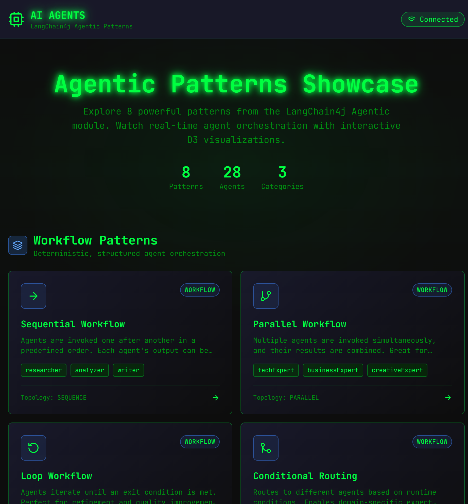

# AI Agents - LangChain4j Agentic Patterns Showcase

A showcase application demonstrating **8 agentic patterns** from LangChain4j with real-time visualization using D3.js and WebSocket streaming.



## Table of Contents

- [Features](#features)
- [Patterns Demonstrated](#patterns-demonstrated)
- [Quick Start](#getting-started)
- [Azure Deployment](#azure-deployment)
- [Beginner's Guide to Agentic Patterns](#beginners-guide-to-agentic-patterns)
- [Technical Architecture](#technical-architecture)
- [API Reference](#api-endpoints)
- [License](#license)

## Features

- **8 Agentic Patterns** with interactive visualizations
- **Real-time WebSocket** streaming of agent events
- **D3.js** animated topology graphs
- **Dark-themed UI** with Tailwind CSS
- **Azure OpenAI** integration via LangChain4j

## Patterns Demonstrated

### Workflow Patterns (Deterministic Orchestration)
| Pattern | Description | Topology |
|---------|-------------|----------|
| **Sequential** | Agents invoked one after another in order | Chain |
| **Parallel** | Multiple agents run simultaneously | Fan-out |
| **Loop** | Iterative refinement until exit condition | Cycle |
| **Conditional** | Routes to different agents based on conditions | Branch |

### Agentic Patterns (LLM-Driven Orchestration)
| Pattern | Description | Topology |
|---------|-------------|----------|
| **Supervisor** | LLM plans and orchestrates sub-agents | Star |
| **Human-in-the-Loop** | Pauses for human approval | Gated |

### Planning Patterns (Custom Planners)
| Pattern | Description | Topology |
|---------|-------------|----------|
| **GOAP** | Goal-Oriented Action Planning | DAG |
| **P2P** | Peer-to-peer decentralized coordination | Mesh |

## Beginner's Guide to Agentic Patterns

New to AI agents? This guide explains each pattern in plain English with real-world analogies.

### What is an "Agent"?

An **agent** is an AI that can take actions autonomously. Unlike a simple chatbot that just responds to questions, an agent can:
- Break down complex tasks into steps
- Use tools and call other agents
- Make decisions based on context
- Remember state across interactions

Think of agents like specialized workers in a factory - each has a specific job, and they work together to produce a result.

---

### Workflow Patterns

These patterns follow **deterministic rules** - you define exactly how agents interact.

#### 1. Sequential Workflow (Chain)

**What it does:** Agents run one after another, like an assembly line.

**Real-world analogy:** Writing a book where:
1. **Researcher** gathers facts
2. **Writer** creates the draft
3. **Editor** polishes the final text

**When to use:** When each step depends on the previous step's output.

**Example prompt:** *"Write a fantasy story for teenagers in a humorous style"*
- CreativeWriter → AudienceEditor → StyleEditor

---

#### 2. Parallel Workflow (Fan-out)

**What it does:** Multiple agents run at the same time, then results are combined.

**Real-world analogy:** Getting opinions from multiple experts simultaneously:
- **Technical Expert** evaluates feasibility
- **Business Expert** evaluates cost
- **Creative Expert** evaluates user appeal

**When to use:** When you need diverse perspectives quickly.

**Example prompt:** *"Evaluate this startup idea: AI-powered pet translator"*

---

#### 3. Loop Workflow (Cycle)

**What it does:** Agents iterate and refine until a quality threshold is met.

**Real-world analogy:** Code review cycles:
1. **Generator** writes code
2. **Critic** reviews and finds issues
3. **Refiner** improves based on feedback
4. Repeat until the critic approves

**When to use:** When quality matters more than speed.

**Example prompt:** *"Write a haiku about coding"* (iterates until the critic gives 8+/10)

---

#### 4. Conditional Routing (Branch)

**What it does:** Routes to different specialist agents based on the input.

**Real-world analogy:** Hospital triage:
- Heart problem → **Cardiologist**
- Broken bone → **Orthopedist**
- Skin issue → **Dermatologist**

**When to use:** When different inputs need different expertise.

**Example prompt:** *"I have chest pain"* → routes to medical expert

---

### Agentic Patterns

These patterns use **LLM intelligence** to decide how agents interact.

#### 5. Supervisor Agent (Star)

**What it does:** A "boss" agent plans and delegates to worker agents.

**Real-world analogy:** A project manager who:
1. Receives a complex request
2. Breaks it into subtasks
3. Assigns each subtask to the right specialist
4. Combines their outputs into a final deliverable

**When to use:** Complex tasks requiring multiple skills.

**Example prompt:** *"Transfer 100 USD from Mario to Georgios, then convert 50 USD to EUR"*
- BankSupervisor delegates to: WithdrawAgent, CreditAgent, ExchangeAgent

---

#### 6. Human-in-the-Loop (Gated)

**What it does:** Pauses execution to get human input or approval.

**Real-world analogy:** Expense approval workflow:
1. **System** prepares an expense report
2. **Human** reviews and approves
3. **System** processes the approved expense

**When to use:** High-stakes decisions, legal/compliance requirements, or when AI needs human judgment.

**Example prompt:** *"What is the zodiac"*
- Asks human: "What is your zodiac sign?"
- Uses human's answer to generate personalized horoscope

---

### Planning Patterns

These patterns use **advanced planning algorithms** for complex orchestration.

#### 7. GOAP - Goal-Oriented Action Planning (DAG)

**What it does:** Finds the optimal sequence of agents to reach a goal, like GPS finding the shortest route.

**Real-world analogy:** Planning a dinner party:
- **Goal:** Serve a gourmet meal
- **Available actions:** Buy ingredients, prep vegetables, cook main dish, set table, plate food
- **GOAP finds:** The most efficient order considering dependencies (can't cook before buying ingredients)

**When to use:** Complex goals with many possible paths.

**Example prompt:** *"Generate a personalized horoscope for someone born on March 15th"*
- GOAP calculates: GoalPlanner → PersonExtractor → SignExtractor → HoroscopeGenerator → WriterAgent

---

#### 8. P2P - Peer-to-Peer (Mesh)

**What it does:** Agents collaborate as equals, reacting to each other's outputs without a central controller.

**Real-world analogy:** A writers' room:
- **Idea Generator** throws out concepts
- **Critic** challenges weak ideas
- **Validator** checks feasibility
- **Scorer** ranks the best options
- They iterate until consensus emerges

**When to use:** Creative tasks, brainstorming, when you want emergent behavior.

**Example prompt:** *"Generate and evaluate startup ideas for AI in healthcare"*

---

### Choosing the Right Pattern

| Situation | Recommended Pattern |
|-----------|---------------------|
| Simple pipeline with clear steps | Sequential |
| Need multiple perspectives fast | Parallel |
| Quality is critical, time isn't | Loop |
| Different inputs need different handling | Conditional |
| Complex task, unclear how to break down | Supervisor |
| Need human approval or input | Human-in-the-Loop |
| Many dependencies, need optimal path | GOAP |
| Creative/brainstorming, want collaboration | P2P |

---

## Technical Architecture

### AgenticScope: Unified State Management

All 8 patterns in this showcase use **LangChain4j's `AgenticServices`** builders with `AgenticScope` for unified state management. The `AgenticScope` provides:

- **State sharing** between agents via `scope.readState()` / `scope.writeState()`
- **Output key mapping** via `@Agent(outputKey = "result")` 
- **Agent invocation tracking** for debugging
- **Real-time events** via `AgentListener` for WebSocket streaming

#### Pattern Implementation Summary

| Pattern | Builder Used | AgenticScope Access |
|---------|-------------|---------------------|
| **Sequence** | `AgenticServices.sequenceBuilder()` | `invokeWithAgenticScope()` |
| **Parallel** | `AgenticServices.createAgenticSystem()` | Internal (annotation-driven) |
| **Loop** | `AgenticServices.loopBuilder()` | `invokeWithAgenticScope()` |
| **Conditional** | `AgenticServices.createAgenticSystem()` | Internal (annotation-driven) |
| **Supervisor** | `AgenticServices.supervisorBuilder()` | Internal (LLM-driven) |
| **Human-in-Loop** | `AgenticServices.agentBuilder()` | Manual orchestration for human wait |
| **GOAP** | `AgenticServices.plannerBuilder()` + `GoalOrientedPlanner` | `invokeWithAgenticScope()` |
| **P2P** | `AgenticServices.plannerBuilder()` + `P2PPlanner` | `invokeWithAgenticScope()` |

#### Real-Time WebSocket Events with AgentListener

The key to real-time UI updates is the `AgentListener` interface. All patterns that use builders like `sequenceBuilder()`, `loopBuilder()`, or `plannerBuilder()` can attach a listener:

```java
// Sequence with real-time WebSocket events
UntypedAgent novelCreator = AgenticServices.sequenceBuilder()
    .name("novelCreator")
    .subAgents(writer, audienceEditor, styleEditor)
    .listener(webSocketListener)  // ← Receives events as agents execute
    .outputKey("story")
    .build();

ResultWithAgenticScope<String> result = novelCreator.invokeWithAgenticScope(
    Map.of("topic", topic, "audience", audience, "style", style));
```

The `WebSocketAgentListener` implements `AgentListener` to capture:
- `beforeAgentExecution()` → Publish "AGENT_INVOKED" event
- `afterAgentExecution()` → Publish "AGENT_COMPLETED" event with output
- State changes → Publish "STATE_UPDATED" events

#### Planning Patterns with Custom Planners

GOAP and P2P use `AgenticServices.plannerBuilder()` with custom planner implementations:

```java
// GOAP - Goal-Oriented Action Planning
UntypedAgent goapWorkflow = AgenticServices.plannerBuilder()
    .subAgents(signExtractor, horoscopeGenerator, storyFinder, writer)
    .outputKey("writeup")  // The goal state
    .planner(GoalOrientedPlanner::new)  // Calculates shortest path to goal
    .listener(listener)
    .build();

// P2P - Peer-to-Peer Reactive Collaboration
UntypedAgent p2pWorkflow = AgenticServices.plannerBuilder()
    .subAgents(literatureAgent, hypothesisAgent, criticAgent, scorerAgent)
    .outputKey("hypothesis")
    .planner(() -> new P2PPlanner(plannerModel, 10, scope -> 
        scope.readState("score", 0.0) >= 0.75  // Exit when score threshold reached
    ))
    .listener(listener)
    .build();
```

#### Accessing AgenticScope State

All patterns can access the shared state after execution:

```java
ResultWithAgenticScope<String> result = workflow.invokeWithAgenticScope(inputs);

// Access the result
String output = result.result();

// Access intermediate state from AgenticScope
AgenticScope scope = result.agenticScope();
Double score = scope.readState("score", 0.0);
String hypothesis = scope.readState("hypothesis", "");
```

---

## Tech Stack

### Backend
- **Java 21** with Virtual Threads
- **Spring Boot 4.0.1**
- **LangChain4j 1.10.0** (Core)
- **LangChain4j Agentic 1.10.0-beta18** (Agent framework)
- **LangChain4j OpenAI Official 1.10.0-beta18** (Azure OpenAI)
- **Spring Dotenv** for `.env` file support
- **WebSocket** (STOMP over SockJS)

### Frontend
- **React 18** with TypeScript
- **Vite 5** build tool
- **D3.js** for visualizations
- **Tailwind CSS** for styling
- **React Router** for navigation

## Getting Started

### Prerequisites
- Java 21+
- Node.js 18+
- Maven 3.9+
- Azure OpenAI API access

### Backend Setup

1. Create a `.env` file in the project root with your Azure OpenAI credentials:
```env
AZURE_OPENAI_ENDPOINT=https://your-resource.openai.azure.com/
AZURE_OPENAI_API_KEY=your-api-key
AZURE_OPENAI_DEPLOYMENT=gpt-5
AZURE_OPENAI_EMBEDDING_DEPLOYMENT=text-embedding-3-small
```

> **Note:** The `.env` file is excluded from git via `.gitignore` to keep your credentials secure.

2. Run the backend:
```bash
mvn spring-boot:run
```

The backend will start on `http://localhost:8080`

### Frontend Setup

1. Install dependencies:
```bash
cd frontend
npm install
```

2. Start the development server:
```bash
npm run dev
```

The frontend will start on `http://localhost:5173`

## Azure Deployment

This application includes full Azure infrastructure-as-code for one-click deployment using the Azure Developer CLI (azd).

### Prerequisites
- [Azure Developer CLI (azd)](https://learn.microsoft.com/azure/developer/azure-developer-cli/install-azd)
- [Azure subscription](https://azure.microsoft.com/free/)
- [Docker](https://docs.docker.com/get-docker/) (for container builds)

### Deploy to Azure

1. **Login to Azure**
   ```bash
   azd auth login
   ```

2. **Initialize environment** (first time only)
   ```bash
   azd init
   ```

3. **Provision infrastructure and deploy**
   ```bash
   azd up
   ```

   This will create:
   - Azure Resource Group
   - Azure Container Registry
   - Azure OpenAI with gpt-5-mini and text-embedding-3-small deployments
   - Azure Container Apps Environment
   - Azure Container App (auto-scaling 1-3 replicas)
   - Log Analytics Workspace + Application Insights

4. **Access your app**
   
   After deployment, the Container App URL will be displayed in the terminal output.

### Azure Architecture

```
┌─────────────────────────────────────────────────────────────┐
│                    Azure Resource Group                      │
├─────────────────────────────────────────────────────────────┤
│                                                             │
│  ┌──────────────────┐     ┌──────────────────────────────┐  │
│  │ Container        │     │ Container Apps Environment   │  │
│  │ Registry         │────▶│ ┌────────────────────────┐   │  │
│  │                  │     │ │ AI Agents App          │   │  │
│  └──────────────────┘     │ │ (Java 21 + React)      │   │  │
│                           │ └────────────────────────┘   │  │
│  ┌──────────────────┐     └──────────────────────────────┘  │
│  │ Azure OpenAI     │                │                      │
│  │ - gpt-5-mini     │◀───────────────┘                      │
│  │ - text-embedding │                                       │
│  └──────────────────┘     ┌──────────────────────────────┐  │
│                           │ Monitoring                   │  │
│                           │ - Log Analytics              │  │
│                           │ - Application Insights       │  │
│                           └──────────────────────────────┘  │
└─────────────────────────────────────────────────────────────┘
```

### Clean Up Resources

To delete all Azure resources:
```bash
azd down
```

## Project Structure

```
matrixagents/
├── src/main/java/com/matrixagents/
│   ├── MatrixAgentsApplication.java    # Spring Boot entry
│   ├── agents/                         # Agent interfaces
│   │   ├── SequenceAgents.java
│   │   ├── ParallelAgents.java
│   │   ├── LoopAgents.java
│   │   ├── ConditionalAgents.java
│   │   ├── SupervisorAgents.java
│   │   ├── HumanInLoopAgents.java
│   │   ├── GOAPAgents.java
│   │   └── P2PAgents.java
│   ├── config/
│   │   ├── LangChainConfig.java        # LLM configuration
│   │   └── WebSocketConfig.java        # WebSocket setup
│   ├── controller/
│   │   └── PatternController.java      # REST endpoints
│   └── service/
│       └── PatternExecutionService.java # Pattern orchestration
├── frontend/
│   ├── src/
│   │   ├── components/                 # React components
│   │   ├── context/                    # WebSocket context
│   │   ├── pages/                      # Page components
│   │   └── types/                      # TypeScript types
│   └── package.json
└── pom.xml
```

## Configuration

### Environment Variables

The application reads Azure OpenAI configuration from a `.env` file in the project root:

| Variable | Description | Example |
|----------|-------------|---------|
| `AZURE_OPENAI_ENDPOINT` | Your Azure OpenAI resource endpoint | `https://your-resource.openai.azure.com/` |
| `AZURE_OPENAI_API_KEY` | Your Azure OpenAI API key | `your-api-key` |
| `AZURE_OPENAI_DEPLOYMENT` | Chat model deployment name | `gpt-5` |
| `AZURE_OPENAI_EMBEDDING_DEPLOYMENT` | Embedding model deployment name | `text-embedding-3-small` |

### Azure OpenAI

The application uses `langchain4j-open-ai-official` which wraps the official OpenAI Java SDK with Azure support:

```java
OpenAiOfficialChatModel.builder()
    .baseUrl(endpoint)
    .apiKey(apiKey)
    .modelName(deploymentName)
    .isAzure(true)
    .build();
```

### WebSocket

Events are streamed via STOMP over SockJS:
- **Endpoint**: `/ws`
- **Subscribe (global)**: `/topic/events`
- **Subscribe (pattern)**: `/topic/patterns/{patternId}`

## API Endpoints

| Method | Endpoint | Description |
|--------|----------|-------------|
| GET | `/api/patterns` | List all patterns |
| GET | `/api/patterns/{id}` | Get pattern details |
| POST | `/api/patterns/{id}/execute` | Execute a pattern |

## UI Features

- **Real-time visualization** of agent execution
- **Event log** with timestamped agent activities
- **Scope view** showing shared state
- **Animated D3 graphs** with agent highlighting
- **Dark-themed** interface

## License

MIT License - see [LICENSE](LICENSE) for details.

## Acknowledgments

- [LangChain4j](https://docs.langchain4j.dev/) - Java LLM framework
- [Spring Boot](https://spring.io/projects/spring-boot) - Application framework
- [D3.js](https://d3js.org/) - Data visualization
