# AI Agents - LangChain4j Agentic Patterns Showcase

A showcase application demonstrating **8 agentic patterns** from LangChain4j with real-time visualization using D3.js and WebSocket streaming.

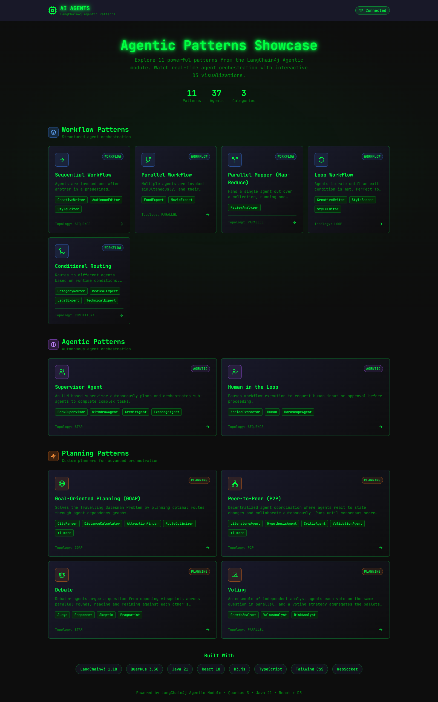

> [!TIP]
> **🔀 Choose Your Framework:** This project supports two backend frameworks. **You are currently viewing the Quarkus branch.**

| Branch | Framework | Command |
|--------|-----------|----------|
| `quarkus` | **Quarkus** ✅ *(current)* | `git checkout quarkus` |
| `main` | **Spring Boot** | `git checkout main` |

## Table of Contents

- [Features](#features)
- [Patterns Demonstrated](#patterns-demonstrated)
- [Quick Start](#getting-started)
- [Azure Deployment](#azure-deployment)
- [Beginner's Guide to Agentic Patterns](#beginners-guide-to-agentic-patterns)
- [Technical Architecture](#technical-architecture)
- [API Reference](#api-endpoints)
- [FAQ](#faq)
- [License](#license)

## Features

- **8 Agentic Patterns** with interactive visualizations
- **Real-time WebSocket** streaming of agent events
- **D3.js** animated topology graphs with agent tooltips (hover to see each agent's role)
- **Event log** with timestamped agent activities and scope state inspector
- **Dark-themed UI** with Tailwind CSS
- **Azure OpenAI** integration via LangChain4j

## Patterns Demonstrated

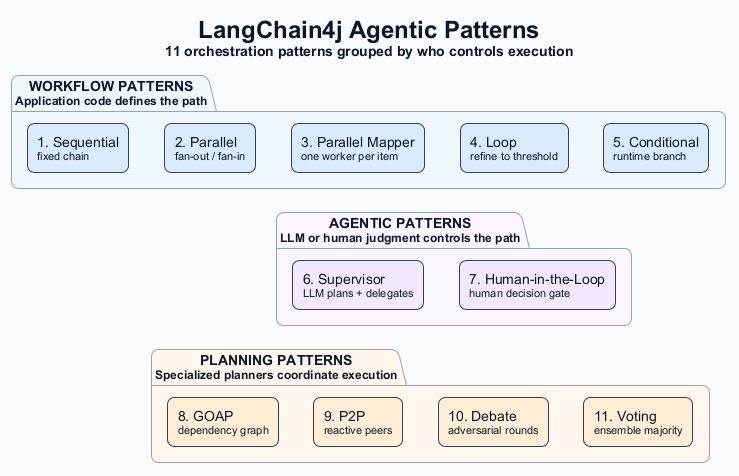

### Workflow Patterns (Deterministic Orchestration)
| Pattern | Description | Topology |
|---------|-------------|----------|
| **Sequential** | Agents invoked one after another in order | Chain |
| **Parallel** | Multiple agents run simultaneously | Fan-out |
| **Loop** | Iterative refinement until exit condition | Cycle |
| **Conditional** | Routes to different agents based on conditions | Branch |

### Agentic Patterns (LLM-Driven Orchestration)
| Pattern | Description | Topology |
|---------|-------------|----------|
| **Supervisor** | LLM plans and orchestrates sub-agents | Star |
| **Human-in-the-Loop** | Pauses for human approval | Gated |

### Planning Patterns (Custom Planners)
| Pattern | Description | Topology |
|---------|-------------|----------|
| **GOAP** | Travelling Salesman via Goal-Oriented Action Planning | DAG |
| **P2P** | Peer-to-peer decentralized coordination | Mesh |

## Beginner's Guide to Agentic Patterns

New to AI agents? This guide explains each pattern in plain English with real-world analogies.

### What is an "Agent"?

An **agent** is an AI that can take actions autonomously. Unlike a simple chatbot that just responds to questions, an agent can:
- Break down complex tasks into steps
- Use tools and call other agents
- Make decisions based on context
- Remember state across interactions

Think of agents like specialized workers in a factory - each has a specific job, and they work together to produce a result.

---

### Workflow Patterns

These patterns follow **deterministic rules** - you define exactly how agents interact.

#### 1. Sequential Workflow (Chain)

**What it does:** Agents run one after another, like an assembly line.

**Real-world analogy:** Writing a book where:
1. **Researcher** gathers facts
2. **Writer** creates the draft
3. **Editor** polishes the final text

**When to use:** When each step depends on the previous step's output.

**Example prompt:** *"Write a fantasy story for teenagers in a humorous style"*
- CreativeWriter → AudienceEditor → StyleEditor

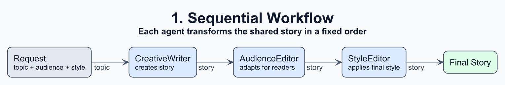

---

#### 2. Parallel Workflow (Fan-out)

**What it does:** Multiple agents run at the same time, then results are combined.

**Real-world analogy:** Planning a perfect evening by consulting specialists simultaneously:
- **Food Expert** suggests meals matching your mood
- **Movie Expert** recommends films matching your mood

**When to use:** When you need diverse perspectives quickly.

**Example prompt:** *"Plan an evening for a romantic mood"*
- FoodExpert + MovieExpert run in parallel, then a Combiner merges the results

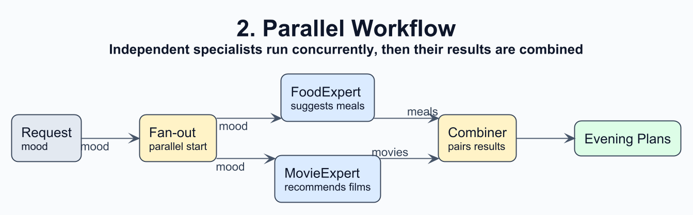

---

#### 3. Loop Workflow (Cycle)

**What it does:** Agents iterate and refine until a quality threshold is met.

**Real-world analogy:** Code review cycles:
1. **Generator** writes code
2. **Critic** reviews and finds issues
3. **Refiner** improves based on feedback
4. Repeat until the critic approves

**When to use:** When quality matters more than speed.

**Example prompt:** *"Write a haiku about coding"* (iterates until the critic gives 8+/10)

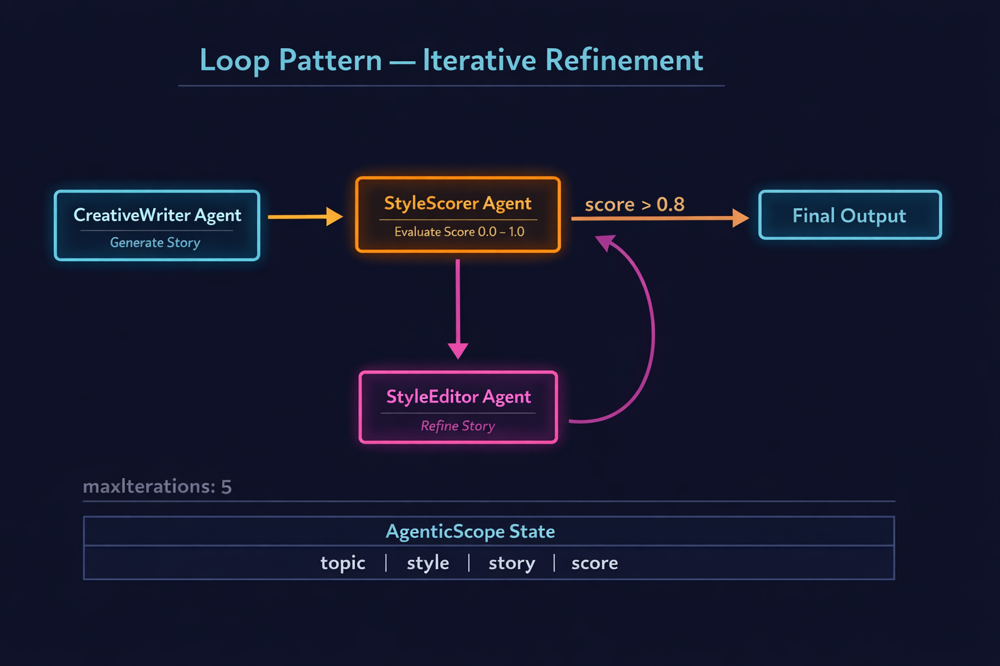= 0.8 or maxIterations(5) is reached." width="800"/>

---

#### 4. Conditional Routing (Branch)

**What it does:** Routes to different specialist agents based on the input.

**Real-world analogy:** Hospital triage:
- Heart problem → **Cardiologist**
- Broken bone → **Orthopedist**
- Skin issue → **Dermatologist**

**When to use:** When different inputs need different expertise.

**Example prompt:** *"I have chest pain"* → routes to medical expert

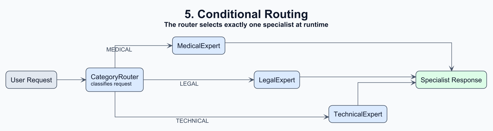

---

### Agentic Patterns

These patterns use **LLM intelligence** to decide how agents interact.

#### 5. Supervisor Agent (Star)

**What it does:** A "boss" agent plans and delegates to worker agents.

**Real-world analogy:** A project manager who:
1. Receives a complex request
2. Breaks it into subtasks
3. Assigns each subtask to the right specialist
4. Combines their outputs into a final deliverable

**When to use:** Complex tasks requiring multiple skills.

**Example prompt:** *"Transfer 100 USD from Mario to Georgios, then convert 50 USD to EUR"*
- BankSupervisor delegates to: WithdrawAgent, CreditAgent, ExchangeAgent

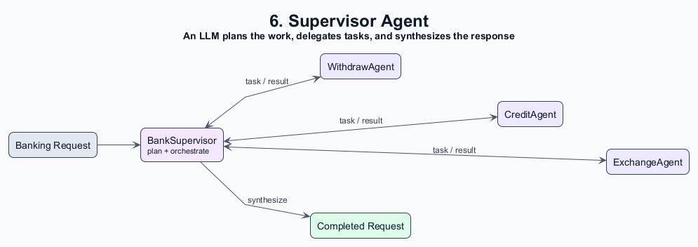

---

#### 6. Human-in-the-Loop (Gated)

**What it does:** Pauses execution to get human input or approval.

**Real-world analogy:** Expense approval workflow:
1. **System** prepares an expense report
2. **Human** reviews and approves
3. **System** processes the approved expense

**When to use:** High-stakes decisions, legal/compliance requirements, or when AI needs human judgment.

**Example prompt:** *"What is the zodiac"*
- Asks human: "What is your zodiac sign?"
- Uses human's answer to generate personalized horoscope

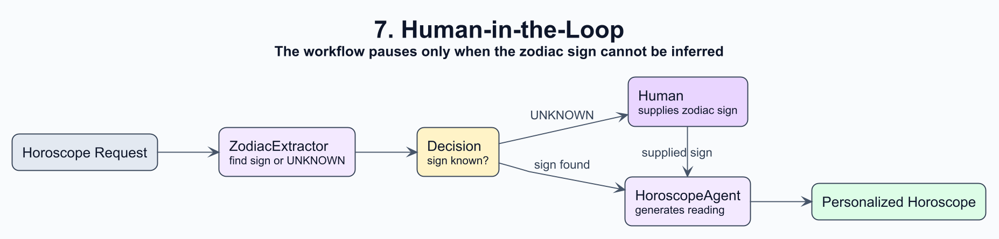

---

### Planning Patterns

These patterns use **advanced planning algorithms** for complex orchestration.

#### 7. GOAP - Goal-Oriented Action Planning (DAG)

**What it does:** Finds the optimal sequence of agents to reach a goal, like GPS finding the shortest route. The planner builds a dependency graph from each agent's inputs and outputs, then calculates the shortest path from the current state to the goal.

**Real-world analogy:** Solving the Travelling Salesman Problem — planning the most efficient multi-city trip:
- **Goal:** Produce a complete travel itinerary
- **Available agents:** CityParser, DistanceCalculator, AttractionFinder, RouteOptimizer, ItineraryPlanner
- **GOAP finds:** The optimal execution order by analyzing what each agent needs and produces

**When to use:** Complex goals with many possible paths and agent dependencies.

**Example prompt:** *"Plan a trip visiting Paris, London, Rome, Berlin and Barcelona"*

**How the dependency graph works:**

The `GoalOrientedPlanner` inspects each agent's `@V` input parameters and `outputKey` to build a **directed acyclic graph (DAG)** — a graph where edges have direction (A → B, not A ↔ B) and there are no cycles, guaranteeing the planner always terminates. Unlike Sequential (chain), Parallel (fan-out), or Loop (cycle), a DAG can express branching, parallelism, and convergence all in one structure, driven purely by data dependencies:

```
Agent              Inputs              Output       Cost
─────────────────  ──────────────────  ───────────  ────
CityParser         prompt              cities       1
DistanceCalculator cities              distances    1
AttractionFinder   cities              attractions  1
RouteOptimizer     distances           route        1
ItineraryPlanner   route, attractions  itinerary    1
```

From this, the planner computes the shortest path from `prompt` → `itinerary`:

```
                    ┌─→ DistanceCalculator ─→ RouteOptimizer ─┐
prompt → CityParser │                                         ├─→ ItineraryPlanner → itinerary ✓
                    └─→ AttractionFinder ─────────────────────┘
```

**Why this route:**
1. **CityParser** runs first — it's the only agent whose input (`prompt`) is available in the initial state
2. **DistanceCalculator** and **AttractionFinder** both depend only on `cities` — they form **parallel branches** in the graph (both could theoretically run simultaneously)
3. **RouteOptimizer** depends on `distances` — it solves the TSP, finding the shortest Hamiltonian circuit through all cities
4. **ItineraryPlanner** depends on both `route` and `attractions` — it's the **convergence point** that merges both branches into the final day-by-day itinerary

The planner won't execute an agent until all its input keys are present in the `AgenticScope` shared state. This ensures correctness: you can't optimize a route without distances, and you can't plan an itinerary without both the route and the attractions.

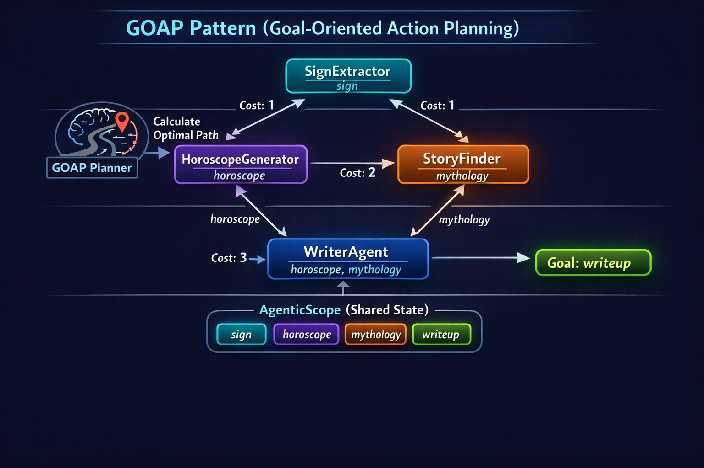

---

#### 8. P2P - Peer-to-Peer (Mesh)

**What it does:** Agents collaborate as equals, reacting to each other's outputs without a central controller.

**Real-world analogy:** A research lab:
- **LiteratureAgent** reviews existing research
- **HypothesisAgent** formulates testable hypotheses
- **CriticAgent** challenges weak hypotheses
- **ValidationAgent** refines based on critique
- **ScorerAgent** evaluates quality
- They iterate reactively until quality threshold is met

**When to use:** Research, brainstorming, when you want emergent collaboration.

**Example prompt:** *"Generate and evaluate startup ideas for AI in healthcare"*

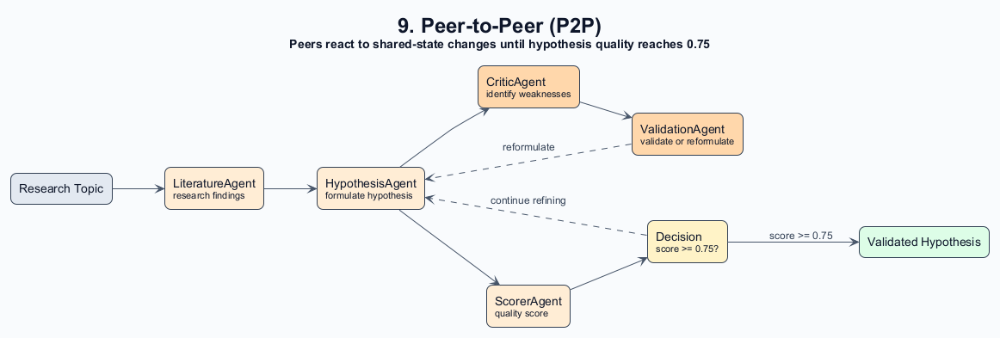

---

### Choosing the Right Pattern

With 8 patterns available, picking the right one is the most important design decision. The key is matching the **structure of your problem** to the **coordination style** of the pattern. Ask yourself: Is the task a straightforward pipeline, or does it need dynamic planning? Do agents need to collaborate, or work independently? Is human judgment required?

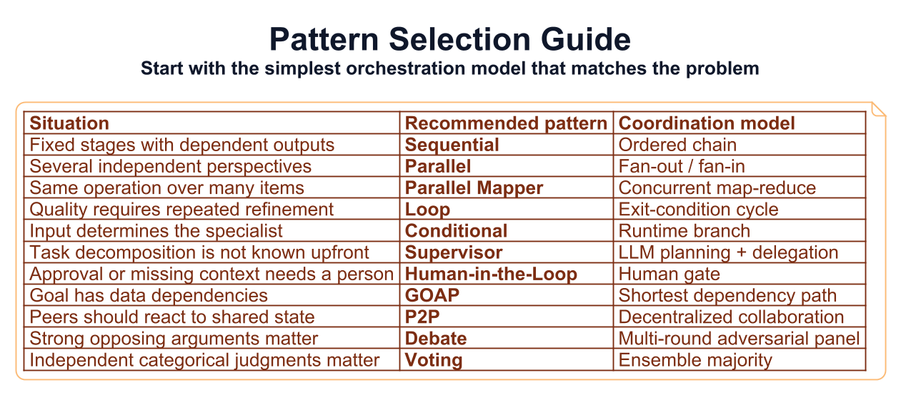

| Situation | Recommended Pattern | Why |
|-----------|---------------------|-----|
| Simple pipeline with clear steps | **Sequential** | Each step depends on the previous — no branching or parallelism needed |
| Need multiple perspectives fast | **Parallel** | Fan-out to independent experts, then combine — minimizes latency |
| Quality is critical, time isn't | **Loop** | Iterative refinement with a critic ensures output meets a quality bar |
| Different inputs need different handling | **Conditional** | Route to the right specialist based on input classification |
| Complex task, unclear how to break down | **Supervisor** | Let the LLM decompose the task and delegate dynamically |
| Need human approval or input | **Human-in-the-Loop** | Gate critical decisions behind human review before proceeding |
| Many dependencies, need optimal path | **GOAP** | Builds a dependency graph from agent inputs/outputs and finds the shortest execution path |
| Creative/brainstorming, want collaboration | **P2P** | Agents react to each other as equals — emergent collaboration |

> **Tip:** Start with the simplest pattern that fits. You can always compose patterns — for example, a Supervisor that delegates to a Loop sub-workflow, or a GOAP plan where individual steps run in Parallel.

---

## Technical Architecture

### AgenticScope: Unified State Management

All 8 patterns in this showcase use **LangChain4j's `AgenticServices`** builders with `AgenticScope` for unified state management. The `AgenticScope` provides:

- **State sharing** between agents via `scope.readState()` / `scope.writeState()`
- **Output key mapping** via `@Agent(outputKey = "result")` 
- **Agent invocation tracking** for debugging
- **Real-time events** via `AgentListener` for WebSocket streaming

#### Two Equivalent Approaches: Programmatic vs Declarative

LangChain4j's Agentic framework offers **two equivalent and interchangeable approaches** for building agent workflows:

| Approach | Method | Best For |
|----------|--------|----------|
| **Programmatic** | Builder APIs (`sequenceBuilder()`, `loopBuilder()`, etc.) | Dynamic workflows, runtime configuration, complex orchestration |
| **Declarative** | Annotations + `createAgenticSystem()` | Simple, readable definitions, compile-time validation |

**Both approaches are fully equivalent** — you can achieve the same results with either, and you can even **mix them** in the same application (as this showcase demonstrates).

**Programmatic Example:**
```java
UntypedAgent workflow = AgenticServices.sequenceBuilder()
    .name("myWorkflow")
    .subAgents(agent1, agent2, agent3)
    .listener(listener)
    .build();
```

**Declarative Example:**
```java
@Agent(description = "Orchestrates multiple experts")
interface MyWorkflow {
    @Parallel  // or @Sequential, @Conditional, etc.
    String process(@State("input") String input);
}
MyWorkflow workflow = AgenticServices.createAgenticSystem(MyWorkflow.class, model);
```

#### Pattern Implementation Summary

| Pattern | Approach | API Used |
|---------|----------|----------|
| **Sequence** | Programmatic | `AgenticServices.sequenceBuilder()` |
| **Parallel** | Declarative | `AgenticServices.createAgenticSystem()` with `@Parallel` |
| **Loop** | Programmatic | `AgenticServices.loopBuilder()` |
| **Conditional** | Programmatic | `AgenticServices.agentBuilder()` with manual routing |
| **Supervisor** | Programmatic | `AgenticServices.supervisorBuilder()` |
| **Human-in-Loop** | Programmatic | `AgenticServices.agentBuilder()` |
| **GOAP** | Programmatic | `AgenticServices.plannerBuilder()` + `GoalOrientedPlanner` |
| **P2P** | Programmatic | `AgenticServices.plannerBuilder()` + `P2PPlanner` |

> **Note:** This showcase intentionally uses both approaches to demonstrate their equivalence. You could rewrite the Parallel pattern using `sequenceBuilder()` + manual parallel execution, or rewrite the Sequence pattern using annotations — the choice is purely stylistic.

#### Real-Time WebSocket Events with AgentListener

The key to real-time UI updates is the `AgentListener` interface. All patterns that use builders like `sequenceBuilder()`, `loopBuilder()`, or `plannerBuilder()` can attach a listener:

```java
// Sequence with real-time WebSocket events
UntypedAgent novelCreator = AgenticServices.sequenceBuilder()
    .name("novelCreator")
    .subAgents(writer, audienceEditor, styleEditor)
    .listener(webSocketListener)  // ← Receives events as agents execute
    .outputKey("story")
    .build();

ResultWithAgenticScope<String> result = novelCreator.invokeWithAgenticScope(
    Map.of("topic", topic, "audience", audience, "style", style));
```

The `WebSocketAgentListener` implements `AgentListener` to capture:
- `beforeAgentInvocation()` → Publish "AGENT_INVOKED" event
- `afterAgentInvocation()` → Publish "AGENT_COMPLETED" event with output
- State changes → Publish "STATE_UPDATED" events

#### Planning Patterns with Custom Planners

GOAP and P2P use `AgenticServices.plannerBuilder()` with custom planner implementations:

```java
// GOAP - Goal-Oriented Action Planning (TSP Travel Planner)
UntypedAgent goapWorkflow = AgenticServices.plannerBuilder()
    .subAgents(cityParser, distanceCalculator, attractionFinder, routeOptimizer, itineraryPlanner)
    .outputKey("itinerary")  // The goal state
    .planner(GoalOrientedPlanner::new)  // Calculates shortest path to goal
    .listener(listener)
    .build();

// P2P - Peer-to-Peer Reactive Collaboration
UntypedAgent p2pWorkflow = AgenticServices.plannerBuilder()
    .subAgents(literatureAgent, hypothesisAgent, criticAgent, scorerAgent)
    .outputKey("hypothesis")
    .planner(() -> new P2PPlanner(plannerModel, 10, scope -> 
        scope.readState("score", 0.0) >= 0.75  // Exit when score threshold reached
    ))
    .listener(listener)
    .build();
```

#### Accessing AgenticScope State

All patterns can access the shared state after execution:

```java
ResultWithAgenticScope<String> result = workflow.invokeWithAgenticScope(inputs);

// Access the result
String output = result.result();

// Access intermediate state from AgenticScope
AgenticScope scope = result.agenticScope();
Double score = scope.readState("score", 0.0);
String hypothesis = scope.readState("hypothesis", "");
```

---

## Tech Stack

### Backend
- **Java 21** with Virtual Threads
- **Quarkus 3.30.6** *(this branch)* — or **Spring Boot 4.0.1** on the `main` branch
- **LangChain4j 1.10.0** (Core)
- **LangChain4j Agentic 1.10.0-beta18** (Agent framework)
- **LangChain4j OpenAI Official 1.10.0-beta18** (Azure OpenAI)
- **Native Quarkus WebSockets** *(this branch)* — or STOMP over SockJS on `main` branch

### Frontend
- **React 18** with TypeScript
- **Vite 5** build tool
- **D3.js** for visualizations
- **Tailwind CSS** for styling
- **React Router** for navigation

## Getting Started

### Clone and Choose Your Branch

```bash
# Clone the repository
git clone https://github.com/roryp/matrixagents.git
cd matrixagents

# Choose your backend framework:

# Option A: Quarkus (this branch)
git checkout quarkus

# Option B: Spring Boot (main branch)
git checkout main
```

### Prerequisites
- Java 21+
- Node.js 18+
- Maven 3.9+
- Azure OpenAI API access

### Backend Setup

1. Create a `.env` file in the project root with your Azure OpenAI credentials:
```env
AZURE_OPENAI_ENDPOINT=https://your-resource.openai.azure.com/
AZURE_OPENAI_API_KEY=your-api-key
AZURE_OPENAI_DEPLOYMENT=gpt-5
AZURE_OPENAI_EMBEDDING_DEPLOYMENT=text-embedding-3-small
```

> **Note:** The `.env` file is excluded from git via `.gitignore` to keep your credentials secure.

2. Run the backend:

**For Quarkus** *(this branch)*:
```bash
mvn quarkus:dev
```

**For Spring Boot** *(switch to `main` branch first)*:
```bash
mvn spring-boot:run
```

The backend will start on `http://localhost:8080`

### Frontend Setup

1. Install dependencies:
```bash
cd frontend
npm install
```

2. Start the development server:
```bash
npm run dev
```

The frontend will start on `http://localhost:5173`

## Azure Deployment

This application includes full Azure infrastructure-as-code for one-click deployment using the Azure Developer CLI (azd).

### Prerequisites
- [Azure Developer CLI (azd)](https://learn.microsoft.com/azure/developer/azure-developer-cli/install-azd)
- [Azure subscription](https://azure.microsoft.com/free/)
- [Docker](https://docs.docker.com/get-docker/) (for container builds)

### Deploy to Azure

1. **Login to Azure**
   ```bash
   azd auth login
   ```

2. **Initialize environment** (first time only)
   ```bash
   azd init
   ```

3. **Provision infrastructure and deploy**
   ```bash
   azd up
   ```

   This will create:
   - Azure Resource Group
   - Azure Container Registry
   - Azure OpenAI with gpt-5-mini and text-embedding-3-small deployments
   - Azure Container Apps Environment
   - Azure Container App (auto-scaling 1-3 replicas)
   - Log Analytics Workspace + Application Insights

4. **Access your app**
   
   After deployment, the Container App URL will be displayed in the terminal output.

### Azure Architecture

The application deploys as a single container to **Azure Container Apps**, with all resources managed within one Azure Resource Group. The architecture follows a clean separation between compute, AI services, and observability:

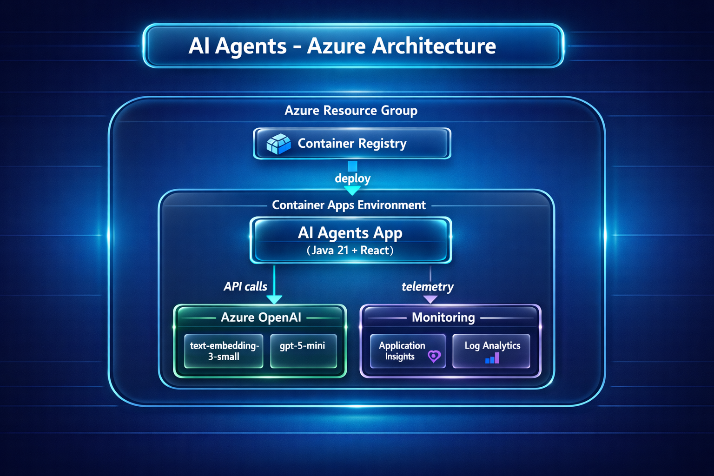

| Component | Purpose |
|-----------|---------|
| **Container Registry** | Stores the Docker image (Java 21 backend + React frontend bundled together) |
| **Container Apps Environment** | Serverless container hosting with auto-scaling (1–3 replicas) and built-in ingress |
| **Azure OpenAI** | Provides `gpt-5-mini` for agent chat completions and `text-embedding-3-small` for vector embeddings |
| **Application Insights** | Distributed tracing, live metrics, and performance monitoring for the running app |
| **Log Analytics** | Centralized log aggregation for container logs, request traces, and diagnostics |

All infrastructure is defined as **Bicep templates** in the `infra/` directory and provisioned automatically via `azd up`.

### Clean Up Resources

To delete all Azure resources:
```bash
azd down
```

## Project Structure

```
matrixagents/
├── src/main/java/com/matrixagents/
│   ├── agents/                         # Agent interfaces
│   │   ├── SequenceAgents.java
│   │   ├── ParallelAgents.java
│   │   ├── LoopAgents.java
│   │   ├── ConditionalAgents.java
│   │   ├── SupervisorAgents.java
│   │   ├── HumanInLoopAgents.java
│   │   ├── GOAPAgents.java
│   │   └── P2PAgents.java
│   ├── config/
│   │   └── LangChainConfig.java        # LLM configuration
│   ├── controller/
│   │   ├── PatternController.java      # REST endpoints
│   │   └── WebSocketController.java    # WebSocket messaging
│   ├── model/
│   │   ├── AgentEvent.java
│   │   ├── ExecutionRequest.java
│   │   ├── ExecutionResult.java
│   │   └── PatternInfo.java
│   └── service/
│       ├── EventPublisher.java         # WebSocket event publishing
│       ├── HumanInputService.java      # Human-in-the-loop input handling
│       ├── PatternExecutionService.java # Pattern orchestration
│       └── WebSocketAgentListener.java # AgentListener → WebSocket bridge
├── frontend/
│   ├── src/
│   │   ├── components/                 # React components
│   │   ├── context/                    # WebSocket context
│   │   ├── pages/                      # Page components
│   │   └── types.ts                    # TypeScript types
│   └── package.json
└── pom.xml
```

## API Endpoints

| Method | Endpoint | Description |
|--------|----------|-------------|
| GET | `/api/patterns` | List all patterns |
| GET | `/api/patterns/{patternId}` | Get pattern details |
| POST | `/api/patterns/{patternId}/execute` | Execute a pattern |
| POST | `/api/human-input/{requestId}` | Provide human-in-the-loop input |
| GET | `/api/human-input/pending` | Get pending human input requests |
| GET | `/api/health` | Health check |
| WS | `/ws` | Native Quarkus WebSocket endpoint |

## FAQ

### General

<details>
<summary><strong>Is this production-ready?</strong></summary>

This is a **showcase/demo application**, not a production system. It's designed to teach agentic patterns and provide reference implementations. You can use the patterns and code as a foundation for production applications, but you'd want to add proper error handling, security, logging, and testing.
</details>

<details>
<summary><strong>What's the difference between the `main` and `quarkus` branches?</strong></summary>

Both branches implement the same 8 agentic patterns with identical functionality. The difference is the backend framework:
- **`quarkus`** — Quarkus 3.30.6 with native Quarkus WebSockets
- **`main`** — Spring Boot 4.0.1 with STOMP/SockJS WebSockets

The frontend, agent logic, and LangChain4j code are the same across both branches.
</details>

### Setup & Configuration

<details>
<summary><strong>Can I use regular OpenAI instead of Azure OpenAI?</strong></summary>

The application uses `langchain4j-open-ai-official` which supports both Azure OpenAI and standard OpenAI. To use standard OpenAI, you would need to modify `LangChainConfig.java` to set `.isAzure(false)` and provide your OpenAI API key instead of Azure credentials.
</details>

<details>
<summary><strong>Which OpenAI model do I need?</strong></summary>

The application defaults to `gpt-5` for chat and `text-embedding-3-small` for embeddings. You can configure any compatible chat model via the `AZURE_OPENAI_DEPLOYMENT` environment variable in your `.env` file.
</details>

### Patterns & Architecture

<details>
<summary><strong>What's the difference between "Workflow" and "Agentic" patterns?</strong></summary>

- **Workflow patterns** (Sequential, Parallel, Loop, Conditional) are **deterministic** — you define exactly how agents interact in code.
- **Agentic patterns** (Supervisor, Human-in-the-Loop) are **LLM-driven** — the LLM decides how to orchestrate agents at runtime.
- **Planning patterns** (GOAP, P2P) use **specialized algorithms** to determine the optimal agent execution plan.
</details>

<details>
<summary><strong>What is AgenticScope?</strong></summary>

`AgenticScope` is LangChain4j's unified state management system. It provides shared state between agents (`readState`/`writeState`), output key mapping, agent invocation tracking, and real-time event publishing via `AgentListener`. All 8 patterns in this showcase use it.
</details>

<details>
<summary><strong>What's the difference between Programmatic and Declarative approaches?</strong></summary>

Both are **fully equivalent** and interchangeable:
- **Programmatic**: Uses builder APIs like `AgenticServices.sequenceBuilder()`. Best for dynamic workflows and complex orchestration.
- **Declarative**: Uses annotations like `@Parallel` and `@Conditional` on interfaces. Best for simple, readable definitions.

This showcase intentionally uses both to demonstrate their equivalence.
</details>

<details>
<summary><strong>How does the real-time visualization work?</strong></summary>

The `WebSocketAgentListener` implements LangChain4j's `AgentListener` interface. It captures `beforeAgentInvocation()` and `afterAgentInvocation()` events and publishes them over native Quarkus WebSockets. The React frontend subscribes to these events and updates D3.js graphs in real time.
</details>

<details>
<summary><strong>How does Human-in-the-Loop work?</strong></summary>

When the Human-in-the-Loop pattern needs human input, it publishes a `HUMAN_INPUT_REQUESTED` WebSocket event with a `requestId`. The frontend displays a modal for the user to respond. The user's input is submitted via `POST /api/human-input/{requestId}`, and the agent workflow resumes.
</details>

### Deployment

<details>
<summary><strong>How much does the Azure deployment cost?</strong></summary>

Costs vary by region and usage, but the main cost drivers are:
- **Azure OpenAI** — pay-per-token for model inference
- **Azure Container Apps** — scales 1–3 replicas based on load
- **Azure Container Registry** — storage for container images

Use `azd down` to delete all resources when you're done to avoid ongoing charges.
</details>

<details>
<summary><strong>Can I deploy without Azure?</strong></summary>

Yes. The application is containerized via the included `Dockerfile`. You can build and run it on any container platform (Docker, Kubernetes, AWS ECS, GCP Cloud Run, etc.). You'll just need to provide the OpenAI credentials as environment variables.
</details>

### Troubleshooting

<details>
<summary><strong>I see "ws proxy socket error: ECONNABORTED" in the Vite console</strong></summary>

This is a **cosmetic error** and does not affect functionality. It's caused by the `http-proxy` library not properly cleaning up WebSocket streams during page navigation or hot module reload. The app works normally. This error doesn't appear in production builds.
</details>

<details>
<summary><strong>The backend starts but agents return errors</strong></summary>

Check that your `.env` file has valid Azure OpenAI credentials and that your deployment name matches an actual deployment in your Azure OpenAI resource. Enable debug logging by checking the `application.yml` — `dev.langchain4j` and `com.matrixagents` are set to `DEBUG` by default.
</details>

<details>
<summary><strong>The frontend can't connect to the backend</strong></summary>

Make sure the backend is running on port 8080 before starting the frontend. The Vite dev server proxies `/api` and `/ws` requests to `http://localhost:8080` (configured in `vite.config.ts`). If you changed the backend port, update the proxy config accordingly.
</details>

<details>
<summary><strong>Pattern execution seems slow</strong></summary>

This is expected — each agent makes one or more LLM API calls, and patterns like Loop and P2P involve multiple iterations. You can monitor progress in real time via the WebSocket event log in the UI.
</details>

## License

MIT License - see [LICENSE](LICENSE) for details.

## Acknowledgments

- [LangChain4j](https://docs.langchain4j.dev/) - Java LLM framework
- [Quarkus](https://quarkus.io/) - Application framework *(this branch)*
- [Spring Boot](https://spring.io/projects/spring-boot) - Application framework (`main` branch)
- [D3.js](https://d3js.org/) - Data visualization
