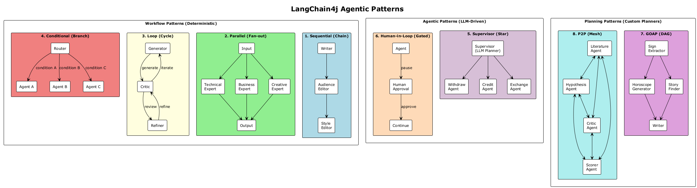
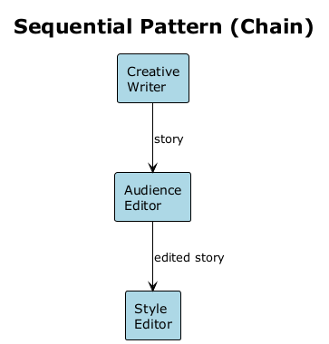
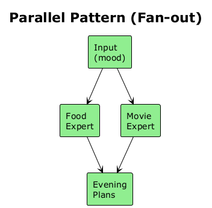
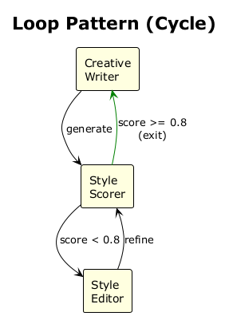
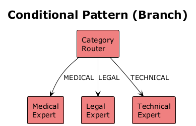
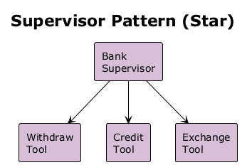
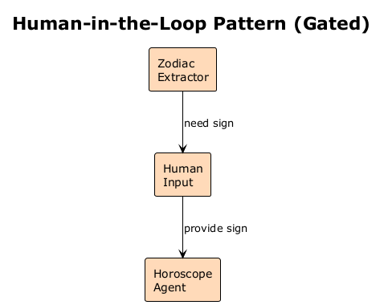
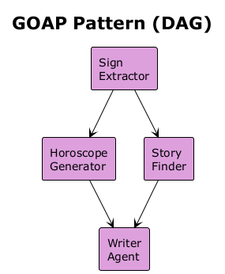
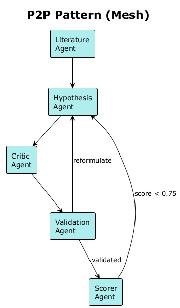
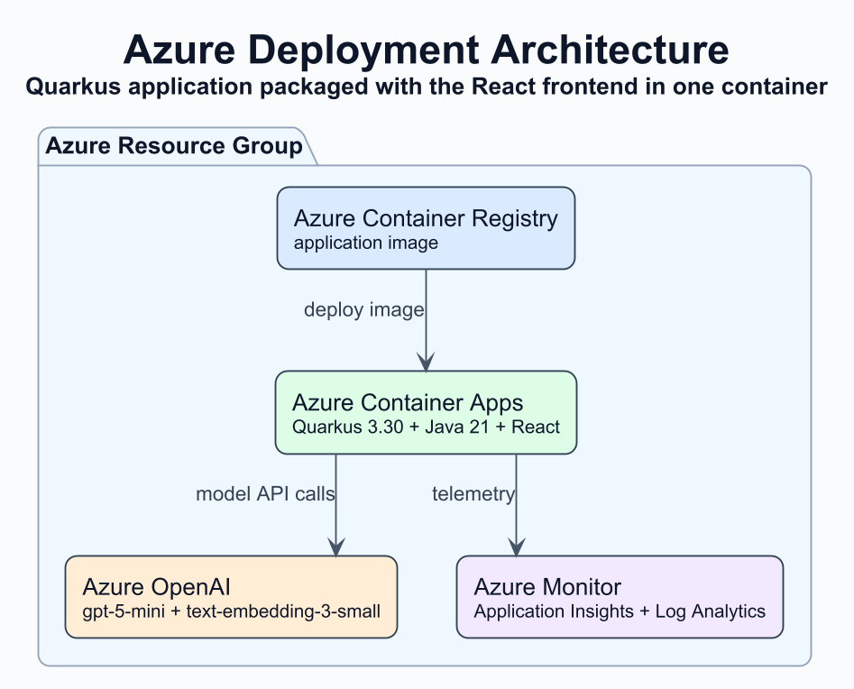

# AI Agents - LangChain4j Agentic Patterns Showcase

A showcase application demonstrating **8 agentic patterns** from LangChain4j with real-time visualization using D3.js and WebSocket streaming.


> [!TIP]
> **🔀 Choose Your Framework:** This project supports two backend frameworks. **You are currently viewing the Quarkus branch.**

| Branch | Framework | Command |
|--------|-----------|----------|
| `quarkus` | **Quarkus** ✅ *(current)* | `git checkout quarkus` |
| `main` | **Spring Boot** | `git checkout main` |

## Table of Contents

- [Features](#features)
- [Patterns Demonstrated](#patterns-demonstrated)
- [Quick Start](#getting-started)
- [Azure Deployment](#azure-deployment)
- [Beginner's Guide to Agentic Patterns](#beginners-guide-to-agentic-patterns)
- [Technical Architecture](#technical-architecture)
- [API Reference](#api-endpoints)
- [FAQ](#faq)
- [License](#license)

## Features

- **8 Agentic Patterns** with interactive visualizations
- **Real-time WebSocket** streaming of agent events
- **D3.js** animated topology graphs with agent tooltips (hover to see each agent's role)
- **Dark-themed UI** with Tailwind CSS
- **Azure OpenAI** integration via LangChain4j

## Patterns Demonstrated



### Workflow Patterns (Deterministic Orchestration)
| Pattern | Description | Topology |
|---------|-------------|----------|
| **Sequential** | Agents invoked one after another in order | Chain |
| **Parallel** | Multiple agents run simultaneously | Fan-out |
| **Loop** | Iterative refinement until exit condition | Cycle |
| **Conditional** | Routes to different agents based on conditions | Branch |

### Agentic Patterns (LLM-Driven Orchestration)
| Pattern | Description | Topology |
|---------|-------------|----------|
| **Supervisor** | LLM plans and orchestrates sub-agents | Star |
| **Human-in-the-Loop** | Pauses for human approval | Gated |

### Planning Patterns (Custom Planners)
| Pattern | Description | Topology |
|---------|-------------|----------|
| **GOAP** | Goal-Oriented Action Planning | DAG |
| **P2P** | Peer-to-peer decentralized coordination | Mesh |

## Beginner's Guide to Agentic Patterns

New to AI agents? This guide explains each pattern in plain English with real-world analogies.

### What is an "Agent"?

An **agent** is an AI that can take actions autonomously. Unlike a simple chatbot that just responds to questions, an agent can:
- Break down complex tasks into steps
- Use tools and call other agents
- Make decisions based on context
- Remember state across interactions

Think of agents like specialized workers in a factory - each has a specific job, and they work together to produce a result.

---

### Workflow Patterns

These patterns follow **deterministic rules** - you define exactly how agents interact.

#### 1. Sequential Workflow (Chain)

**What it does:** Agents run one after another, like an assembly line.

**Real-world analogy:** Writing a book where:
1. **Researcher** gathers facts
2. **Writer** creates the draft
3. **Editor** polishes the final text

**When to use:** When each step depends on the previous step's output.

**Example prompt:** *"Write a fantasy story for teenagers in a humorous style"*
- CreativeWriter → AudienceEditor → StyleEditor



---

#### 2. Parallel Workflow (Fan-out)

**What it does:** Multiple agents run at the same time, then results are combined.

**Real-world analogy:** Getting opinions from multiple experts simultaneously:
- **Technical Expert** evaluates feasibility
- **Business Expert** evaluates cost
- **Creative Expert** evaluates user appeal

**When to use:** When you need diverse perspectives quickly.

**Example prompt:** *"Evaluate this startup idea: AI-powered pet translator"*



---

#### 3. Loop Workflow (Cycle)

**What it does:** Agents iterate and refine until a quality threshold is met.

**Real-world analogy:** Code review cycles:
1. **Generator** writes code
2. **Critic** reviews and finds issues
3. **Refiner** improves based on feedback
4. Repeat until the critic approves

**When to use:** When quality matters more than speed.

**Example prompt:** *"Write a haiku about coding"* (iterates until the critic gives 8+/10)



---

#### 4. Conditional Routing (Branch)

**What it does:** Routes to different specialist agents based on the input.

**Real-world analogy:** Hospital triage:
- Heart problem → **Cardiologist**
- Broken bone → **Orthopedist**
- Skin issue → **Dermatologist**

**When to use:** When different inputs need different expertise.

**Example prompt:** *"I have chest pain"* → routes to medical expert



---

### Agentic Patterns

These patterns use **LLM intelligence** to decide how agents interact.

#### 5. Supervisor Agent (Star)

**What it does:** A "boss" agent plans and delegates to worker agents.

**Real-world analogy:** A project manager who:
1. Receives a complex request
2. Breaks it into subtasks
3. Assigns each subtask to the right specialist
4. Combines their outputs into a final deliverable

**When to use:** Complex tasks requiring multiple skills.

**Example prompt:** *"Transfer 100 USD from Mario to Georgios, then convert 50 USD to EUR"*
- BankSupervisor delegates to: WithdrawAgent, CreditAgent, ExchangeAgent



---

#### 6. Human-in-the-Loop (Gated)

**What it does:** Pauses execution to get human input or approval.

**Real-world analogy:** Expense approval workflow:
1. **System** prepares an expense report
2. **Human** reviews and approves
3. **System** processes the approved expense

**When to use:** High-stakes decisions, legal/compliance requirements, or when AI needs human judgment.

**Example prompt:** *"What is the zodiac"*
- Asks human: "What is your zodiac sign?"
- Uses human's answer to generate personalized horoscope



---

### Planning Patterns

These patterns use **advanced planning algorithms** for complex orchestration.

#### 7. GOAP - Goal-Oriented Action Planning (DAG)

**What it does:** Finds the optimal sequence of agents to reach a goal, like GPS finding the shortest route.

**Real-world analogy:** Planning a dinner party:
- **Goal:** Serve a gourmet meal
- **Available actions:** Buy ingredients, prep vegetables, cook main dish, set table, plate food
- **GOAP finds:** The most efficient order considering dependencies (can't cook before buying ingredients)

**When to use:** Complex goals with many possible paths.

**Example prompt:** *"Generate a personalized horoscope for someone born on March 15th"*
- GOAP calculates the dependency graph and executes: SignExtractor → (HoroscopeGenerator + StoryFinder in parallel) → WriterAgent



---

#### 8. P2P - Peer-to-Peer (Mesh)

**What it does:** Agents collaborate as equals, reacting to each other's outputs without a central controller.

**Real-world analogy:** A research lab:
- **LiteratureAgent** reviews existing research
- **HypothesisAgent** formulates testable hypotheses
- **CriticAgent** challenges weak hypotheses
- **ValidationAgent** refines based on critique
- **ScorerAgent** evaluates quality
- They iterate reactively until quality threshold is met

**When to use:** Research, brainstorming, when you want emergent collaboration.

**Example prompt:** *"Generate and evaluate startup ideas for AI in healthcare"*



---

### Choosing the Right Pattern

| Situation | Recommended Pattern |
|-----------|---------------------|
| Simple pipeline with clear steps | Sequential |
| Need multiple perspectives fast | Parallel |
| Quality is critical, time isn't | Loop |
| Different inputs need different handling | Conditional |
| Complex task, unclear how to break down | Supervisor |
| Need human approval or input | Human-in-the-Loop |
| Many dependencies, need optimal path | GOAP |
| Creative/brainstorming, want collaboration | P2P |

---

## Technical Architecture

### AgenticScope: Unified State Management

All 8 patterns in this showcase use **LangChain4j's `AgenticServices`** builders with `AgenticScope` for unified state management. The `AgenticScope` provides:

- **State sharing** between agents via `scope.readState()` / `scope.writeState()`
- **Output key mapping** via `@Agent(outputKey = "result")` 
- **Agent invocation tracking** for debugging
- **Real-time events** via `AgentListener` for WebSocket streaming

#### Two Equivalent Approaches: Programmatic vs Declarative

LangChain4j's Agentic framework offers **two equivalent and interchangeable approaches** for building agent workflows:

| Approach | Method | Best For |
|----------|--------|----------|
| **Programmatic** | Builder APIs (`sequenceBuilder()`, `loopBuilder()`, etc.) | Dynamic workflows, runtime configuration, complex orchestration |
| **Declarative** | Annotations + `createAgenticSystem()` | Simple, readable definitions, compile-time validation |

**Both approaches are fully equivalent** — you can achieve the same results with either, and you can even **mix them** in the same application (as this showcase demonstrates).

**Programmatic Example:**
```java
UntypedAgent workflow = AgenticServices.sequenceBuilder()
    .name("myWorkflow")
    .subAgents(agent1, agent2, agent3)
    .listener(listener)
    .build();
```

**Declarative Example:**
```java
@Agent(description = "Orchestrates multiple experts")
interface MyWorkflow {
    @Parallel  // or @Sequential, @Conditional, etc.
    String process(@State("input") String input);
}
MyWorkflow workflow = AgenticServices.createAgenticSystem(MyWorkflow.class, model);
```

#### Pattern Implementation Summary

| Pattern | Approach | API Used |
|---------|----------|----------|
| **Sequence** | Programmatic | `AgenticServices.sequenceBuilder()` |
| **Parallel** | Declarative | `AgenticServices.createAgenticSystem()` with `@Parallel` |
| **Loop** | Programmatic | `AgenticServices.loopBuilder()` |
| **Conditional** | Declarative | `AgenticServices.createAgenticSystem()` with `@Conditional` |
| **Supervisor** | Programmatic | `AgenticServices.supervisorBuilder()` |
| **Human-in-Loop** | Programmatic | `AgenticServices.agentBuilder()` |
| **GOAP** | Programmatic | `AgenticServices.plannerBuilder()` + `GoalOrientedPlanner` |
| **P2P** | Programmatic | `AgenticServices.plannerBuilder()` + `P2PPlanner` |

> **Note:** This showcase intentionally uses both approaches to demonstrate their equivalence. You could rewrite the Parallel pattern using `sequenceBuilder()` + manual parallel execution, or rewrite the Sequence pattern using annotations — the choice is purely stylistic.

#### Real-Time WebSocket Events with AgentListener

The key to real-time UI updates is the `AgentListener` interface. All patterns that use builders like `sequenceBuilder()`, `loopBuilder()`, or `plannerBuilder()` can attach a listener:

```java
// Sequence with real-time WebSocket events
UntypedAgent novelCreator = AgenticServices.sequenceBuilder()
    .name("novelCreator")
    .subAgents(writer, audienceEditor, styleEditor)
    .listener(webSocketListener)  // ← Receives events as agents execute
    .outputKey("story")
    .build();

ResultWithAgenticScope<String> result = novelCreator.invokeWithAgenticScope(
    Map.of("topic", topic, "audience", audience, "style", style));
```

The `WebSocketAgentListener` implements `AgentListener` to capture:
- `beforeAgentExecution()` → Publish "AGENT_INVOKED" event
- `afterAgentExecution()` → Publish "AGENT_COMPLETED" event with output
- State changes → Publish "STATE_UPDATED" events

#### Planning Patterns with Custom Planners

GOAP and P2P use `AgenticServices.plannerBuilder()` with custom planner implementations:

```java
// GOAP - Goal-Oriented Action Planning
UntypedAgent goapWorkflow = AgenticServices.plannerBuilder()
    .subAgents(signExtractor, horoscopeGenerator, storyFinder, writer)
    .outputKey("writeup")  // The goal state
    .planner(GoalOrientedPlanner::new)  // Calculates shortest path to goal
    .listener(listener)
    .build();

// P2P - Peer-to-Peer Reactive Collaboration
UntypedAgent p2pWorkflow = AgenticServices.plannerBuilder()
    .subAgents(literatureAgent, hypothesisAgent, criticAgent, scorerAgent)
    .outputKey("hypothesis")
    .planner(() -> new P2PPlanner(plannerModel, 10, scope -> 
        scope.readState("score", 0.0) >= 0.75  // Exit when score threshold reached
    ))
    .listener(listener)
    .build();
```

#### Accessing AgenticScope State

All patterns can access the shared state after execution:

```java
ResultWithAgenticScope<String> result = workflow.invokeWithAgenticScope(inputs);

// Access the result
String output = result.result();

// Access intermediate state from AgenticScope
AgenticScope scope = result.agenticScope();
Double score = scope.readState("score", 0.0);
String hypothesis = scope.readState("hypothesis", "");
```

---

## Tech Stack

### Backend
- **Java 21** with Virtual Threads
- **Quarkus 3.30.6** *(this branch)* — or **Spring Boot 4.0** on the `main` branch
- **LangChain4j 1.10.0** (Core)
- **LangChain4j Agentic 1.10.0-beta18** (Agent framework)
- **LangChain4j OpenAI Official 1.10.0-beta18** (Azure OpenAI)
- **Native Quarkus WebSockets** *(this branch)* — or STOMP over SockJS on `main` branch

### Frontend
- **React 18** with TypeScript
- **Vite 5** build tool
- **D3.js** for visualizations
- **Tailwind CSS** for styling
- **React Router** for navigation

## Getting Started

### Clone and Choose Your Branch

```bash
# Clone the repository
git clone https://github.com/roryp/matrixagents.git
cd matrixagents

# Choose your backend framework:

# Option A: Quarkus (this branch)
git checkout quarkus

# Option B: Spring Boot (main branch)
git checkout main
```

### Prerequisites
- Java 21+
- Node.js 18+
- Maven 3.9+
- Azure OpenAI API access

### Backend Setup

1. Create a `.env` file in the project root with your Azure OpenAI credentials:
```env
AZURE_OPENAI_ENDPOINT=https://your-resource.openai.azure.com/
AZURE_OPENAI_API_KEY=your-api-key
AZURE_OPENAI_DEPLOYMENT=gpt-5
AZURE_OPENAI_EMBEDDING_DEPLOYMENT=text-embedding-3-small
```

> **Note:** The `.env` file is excluded from git via `.gitignore` to keep your credentials secure.

2. Run the backend:

**For Quarkus** *(this branch)*:
```bash
mvn quarkus:dev
```

**For Spring Boot** *(switch to `main` branch first)*:
```bash
mvn spring-boot:run
```

The backend will start on `http://localhost:8080`

### Frontend Setup

1. Install dependencies:
```bash
cd frontend
npm install
```

2. Start the development server:
```bash
npm run dev
```

The frontend will start on `http://localhost:5173`

## Azure Deployment

This application includes full Azure infrastructure-as-code for one-click deployment using the Azure Developer CLI (azd).

### Prerequisites
- [Azure Developer CLI (azd)](https://learn.microsoft.com/azure/developer/azure-developer-cli/install-azd)
- [Azure subscription](https://azure.microsoft.com/free/)
- [Docker](https://docs.docker.com/get-docker/) (for container builds)

### Deploy to Azure

1. **Login to Azure**
   ```bash
   azd auth login
   ```

2. **Initialize environment** (first time only)
   ```bash
   azd init
   ```

3. **Provision infrastructure and deploy**
   ```bash
   azd up
   ```

   This will create:
   - Azure Resource Group
   - Azure Container Registry
   - Azure OpenAI with gpt-5-mini and text-embedding-3-small deployments
   - Azure Container Apps Environment
   - Azure Container App (auto-scaling 1-3 replicas)
   - Log Analytics Workspace + Application Insights

4. **Access your app**
   
   After deployment, the Container App URL will be displayed in the terminal output.

### Azure Architecture



### Clean Up Resources

To delete all Azure resources:
```bash
azd down
```

## Project Structure

```
matrixagents/
├── src/main/java/com/matrixagents/
│   ├── agents/                         # Agent interfaces
│   │   ├── SequenceAgents.java
│   │   ├── ParallelAgents.java
│   │   ├── LoopAgents.java
│   │   ├── ConditionalAgents.java
│   │   ├── SupervisorAgents.java
│   │   ├── HumanInLoopAgents.java
│   │   ├── GOAPAgents.java
│   │   └── P2PAgents.java
│   ├── config/
│   │   └── LangChainConfig.java        # LLM configuration
│   ├── controller/
│   │   ├── PatternController.java      # REST endpoints
│   │   └── WebSocketController.java    # WebSocket messaging
│   ├── model/
│   │   ├── AgentEvent.java
│   │   ├── ExecutionRequest.java
│   │   ├── ExecutionResult.java
│   │   └── PatternInfo.java
│   └── service/
│       ├── EventPublisher.java         # WebSocket event publishing
│       ├── HumanInputService.java      # Human-in-the-loop input handling
│       ├── PatternExecutionService.java # Pattern orchestration
│       └── WebSocketAgentListener.java # AgentListener → WebSocket bridge
├── frontend/
│   ├── src/
│   │   ├── components/                 # React components
│   │   ├── context/                    # WebSocket context
│   │   ├── pages/                      # Page components
│   │   └── types/                      # TypeScript types
│   └── package.json
└── pom.xml
```

## Configuration

### Environment Variables

The application reads Azure OpenAI configuration from a `.env` file in the project root:

| Variable | Description | Example |
|----------|-------------|---------|
| `AZURE_OPENAI_ENDPOINT` | Your Azure OpenAI resource endpoint | `https://your-resource.openai.azure.com/` |
| `AZURE_OPENAI_API_KEY` | Your Azure OpenAI API key | `your-api-key` |
| `AZURE_OPENAI_DEPLOYMENT` | Chat model deployment name | `gpt-5` |
| `AZURE_OPENAI_EMBEDDING_DEPLOYMENT` | Embedding model deployment name | `text-embedding-3-small` |

### Azure OpenAI

The application uses `langchain4j-open-ai-official` which wraps the official OpenAI Java SDK with Azure support:

```java
OpenAiOfficialChatModel.builder()
    .baseUrl(endpoint)
    .apiKey(apiKey)
    .modelName(deploymentName)
    .isAzure(true)
    .build();
```

### WebSocket

Events are streamed via **native Quarkus WebSockets** *(this branch)* — or STOMP over SockJS on the `main` branch:
- **Endpoint**: `/ws`
- **Messages**: JSON events with `type`, `agentName`, `message`, and `patternId`

## API Endpoints

| Method | Endpoint | Description |
|--------|----------|-------------|
| GET | `/api/patterns` | List all patterns |
| GET | `/api/patterns/{patternId}` | Get pattern details |
| POST | `/api/patterns/{patternId}/execute` | Execute a pattern |
| POST | `/api/human-input/{requestId}` | Provide human-in-the-loop input |
| GET | `/api/human-input/pending` | Get pending human input requests |
| GET | `/api/health` | Health check |
| WS | `/ws` | Native Quarkus WebSocket endpoint |

## UI Features

- **Real-time visualization** of agent execution
- **Event log** with timestamped agent activities
- **Scope view** showing shared state
- **Animated D3 graphs** with agent highlighting
- **Dark-themed** interface

## Troubleshooting

### WebSocket Proxy Error in Dev Mode

When running the frontend with `npm run dev`, you may see this error in the Vite console:

```
[vite] ws proxy socket error:
Error: write ECONNABORTED
```

**This is a cosmetic error** and does not affect functionality. It occurs because the underlying `http-proxy` library (used by Vite's dev server) doesn't properly clean up WebSocket streams when connections are interrupted during page navigation or hot module reload. The app will continue to work normally. This error does not appear in production builds.

## FAQ

### General

<details>
<summary><strong>What is this project?</strong></summary>

A showcase application that demonstrates 8 agentic patterns from LangChain4j with a real-time React frontend. It's designed as a learning tool and reference implementation for building multi-agent AI systems in Java.
</details>

<details>
<summary><strong>Is this production-ready?</strong></summary>

This is a **showcase/demo application**, not a production system. It's designed to teach agentic patterns and provide reference implementations. You can use the patterns and code as a foundation for production applications, but you'd want to add proper error handling, security, logging, and testing.
</details>

<details>
<summary><strong>What's the difference between the `main` and `quarkus` branches?</strong></summary>

Both branches implement the same 8 agentic patterns with identical functionality. The difference is the backend framework:
- **`quarkus`** — Quarkus 3.30.6 with native Quarkus WebSockets
- **`main`** — Spring Boot 4.0 with STOMP/SockJS WebSockets

The frontend, agent logic, and LangChain4j code are the same across both branches.
</details>

### Setup & Configuration

<details>
<summary><strong>Can I use regular OpenAI instead of Azure OpenAI?</strong></summary>

The application uses `langchain4j-open-ai-official` which supports both Azure OpenAI and standard OpenAI. To use standard OpenAI, you would need to modify `LangChainConfig.java` to set `.isAzure(false)` and provide your OpenAI API key instead of Azure credentials.
</details>

<details>
<summary><strong>Which OpenAI model do I need?</strong></summary>

The application defaults to `gpt-5` for chat and `text-embedding-3-small` for embeddings. You can configure any compatible chat model via the `AZURE_OPENAI_DEPLOYMENT` environment variable in your `.env` file.
</details>

<details>
<summary><strong>Do I need both Java and Node.js installed?</strong></summary>

Yes. The backend requires **Java 21+** and **Maven 3.9+**. The frontend requires **Node.js 18+**. Both must be running simultaneously during development — the backend on port 8080 and the frontend on port 5173.
</details>

<details>
<summary><strong>Why do I need a `.env` file?</strong></summary>

The `.env` file keeps your Azure OpenAI credentials out of source control. It's listed in `.gitignore` so it won't be committed. The Quarkus backend loads it automatically.
</details>

### Patterns & Architecture

<details>
<summary><strong>What's the difference between "Workflow" and "Agentic" patterns?</strong></summary>

- **Workflow patterns** (Sequential, Parallel, Loop, Conditional) are **deterministic** — you define exactly how agents interact in code.
- **Agentic patterns** (Supervisor, Human-in-the-Loop) are **LLM-driven** — the LLM decides how to orchestrate agents at runtime.
- **Planning patterns** (GOAP, P2P) use **specialized algorithms** to determine the optimal agent execution plan.
</details>

<details>
<summary><strong>What is AgenticScope?</strong></summary>

`AgenticScope` is LangChain4j's unified state management system. It provides shared state between agents (`readState`/`writeState`), output key mapping, agent invocation tracking, and real-time event publishing via `AgentListener`. All 8 patterns in this showcase use it.
</details>

<details>
<summary><strong>What's the difference between Programmatic and Declarative approaches?</strong></summary>

Both are **fully equivalent** and interchangeable:
- **Programmatic**: Uses builder APIs like `AgenticServices.sequenceBuilder()`. Best for dynamic workflows and complex orchestration.
- **Declarative**: Uses annotations like `@Parallel` and `@Conditional` on interfaces. Best for simple, readable definitions.

This showcase intentionally uses both to demonstrate their equivalence.
</details>

<details>
<summary><strong>How does the real-time visualization work?</strong></summary>

The `WebSocketAgentListener` implements LangChain4j's `AgentListener` interface. It captures `beforeAgentExecution()` and `afterAgentExecution()` events and publishes them over native Quarkus WebSockets. The React frontend subscribes to these events and updates D3.js graphs in real time.
</details>

<details>
<summary><strong>How does Human-in-the-Loop work?</strong></summary>

When the Human-in-the-Loop pattern needs human input, it publishes a `HUMAN_INPUT_REQUESTED` WebSocket event with a `requestId`. The frontend displays a modal for the user to respond. The user's input is submitted via `POST /api/human-input/{requestId}`, and the agent workflow resumes.
</details>

### Deployment

<details>
<summary><strong>How much does the Azure deployment cost?</strong></summary>

Costs vary by region and usage, but the main cost drivers are:
- **Azure OpenAI** — pay-per-token for model inference
- **Azure Container Apps** — scales 1–3 replicas based on load
- **Azure Container Registry** — storage for container images

Use `azd down` to delete all resources when you're done to avoid ongoing charges.
</details>

<details>
<summary><strong>Can I deploy without Azure?</strong></summary>

Yes. The application is containerized via the included `Dockerfile`. You can build and run it on any container platform (Docker, Kubernetes, AWS ECS, GCP Cloud Run, etc.). You'll just need to provide the OpenAI credentials as environment variables.
</details>

<details>
<summary><strong>What does `azd up` actually create?</strong></summary>

It provisions: Azure Resource Group, Container Registry, Azure OpenAI (with model deployments), Container Apps Environment, a Container App (auto-scaling 1–3 replicas), Log Analytics Workspace, and Application Insights. All defined as Infrastructure-as-Code in the `infra/` directory using Bicep.
</details>

### Troubleshooting

<details>
<summary><strong>I see "ws proxy socket error: ECONNABORTED" in the Vite console</strong></summary>

This is a **cosmetic error** and does not affect functionality. It's caused by the `http-proxy` library not properly cleaning up WebSocket streams during page navigation or hot module reload. The app works normally. This error doesn't appear in production builds.
</details>

<details>
<summary><strong>The backend starts but agents return errors</strong></summary>

Check that your `.env` file has valid Azure OpenAI credentials and that your deployment name matches an actual deployment in your Azure OpenAI resource. Enable debug logging by checking the `application.yml` — `dev.langchain4j` and `com.matrixagents` are set to `DEBUG` by default.
</details>

<details>
<summary><strong>The frontend can't connect to the backend</strong></summary>

Make sure the backend is running on port 8080 before starting the frontend. The Vite dev server proxies `/api` and `/ws` requests to `http://localhost:8080` (configured in `vite.config.ts`). If you changed the backend port, update the proxy config accordingly.
</details>

<details>
<summary><strong>Pattern execution seems slow</strong></summary>

This is expected — each agent makes one or more LLM API calls, and patterns like Loop and P2P involve multiple iterations. You can monitor progress in real time via the WebSocket event log in the UI.
</details>

## FAQ

### General

**Q: What is this project?**
A: It is a showcase application demonstrating 8 agentic patterns from LangChain4j — Sequential, Parallel, Loop, Conditional, Supervisor, Human-in-the-Loop, GOAP, and P2P — with a real-time D3.js visualization frontend and WebSocket streaming.

**Q: What backend frameworks are supported?**
A: Two frameworks are supported via separate branches: **Quarkus** (on the `quarkus` branch) and **Spring Boot** (on the `main` branch). Both are fully functional and interchangeable.

**Q: What version of Java is required?**
A: Java 21 or later is required. The project uses virtual threads which are a Java 21 feature.

**Q: Do I need an Azure OpenAI account to run this project?**
A: Yes. The application uses Azure OpenAI for its LLM capabilities. You need an Azure OpenAI endpoint, API key, and at least a chat model deployment (e.g., `gpt-5`) and an embedding deployment (e.g., `text-embedding-3-small`).

**Q: Can I use regular OpenAI (non-Azure) instead?**
A: The project is configured for Azure OpenAI via the `langchain4j-open-ai-official` library with `isAzure(true)`. You would need to modify `LangChainConfig.java` to point to the standard OpenAI API and remove the Azure-specific flag.

---

### Setup & Configuration

**Q: How do I configure my Azure OpenAI credentials?**
A: Create a `.env` file in the project root with the following variables:
```env
AZURE_OPENAI_ENDPOINT=https://your-resource.openai.azure.com/
AZURE_OPENAI_API_KEY=your-api-key
AZURE_OPENAI_DEPLOYMENT=gpt-5
AZURE_OPENAI_EMBEDDING_DEPLOYMENT=text-embedding-3-small
```
This file is excluded from git via `.gitignore`.

**Q: What ports does the application use?**
A: The backend runs on `http://localhost:8080` and the frontend development server runs on `http://localhost:5173`. In production, the frontend is served from the backend on port 8080.

**Q: What are the prerequisites to run locally?**
A: You need Java 21+, Node.js 18+, Maven 3.9+, and Azure OpenAI API access. For Azure deployment, you also need the Azure Developer CLI (`azd`) and Docker.

**Q: How do I start the application locally?**
A: Start the backend with `mvn quarkus:dev` (or `mvn spring-boot:run` on the Spring Boot branch), then start the frontend with `cd frontend && npm install && npm run dev`.

---

### Patterns & Architecture

**Q: What is the difference between Workflow Patterns and Agentic Patterns?**
A: **Workflow Patterns** (Sequential, Parallel, Loop, Conditional) follow deterministic rules — you define exactly how agents interact. **Agentic Patterns** (Supervisor, Human-in-the-Loop) use LLM intelligence to decide how agents interact at runtime.

**Q: What are Planning Patterns?**
A: Planning Patterns (GOAP and P2P) use advanced planning algorithms. GOAP finds the optimal sequence of agents to reach a goal (like GPS routing), while P2P lets agents collaborate as equals in a decentralized mesh.

**Q: Which pattern should I use for my use case?**
A: Use **Sequential** for simple pipelines with clear steps, **Parallel** when you need multiple perspectives fast, **Loop** when quality is critical, **Conditional** when different inputs need different handling, **Supervisor** for complex tasks with unclear breakdowns, **Human-in-the-Loop** when human approval is needed, **GOAP** for many dependencies needing an optimal path, and **P2P** for creative brainstorming and emergent collaboration.

**Q: What is AgenticScope?**
A: `AgenticScope` is LangChain4j's unified state management system used by all 8 patterns. It provides state sharing between agents via `readState()`/`writeState()`, output key mapping, agent invocation tracking, and real-time events via `AgentListener`.

**Q: What is the difference between Programmatic and Declarative approaches?**
A: Both are fully equivalent ways to build agent workflows. The **Programmatic** approach uses builder APIs (e.g., `sequenceBuilder()`, `loopBuilder()`) and is best for dynamic workflows and runtime configuration. The **Declarative** approach uses annotations (e.g., `@Parallel`, `@Conditional`) with `createAgenticSystem()` and is best for simple, readable definitions. You can mix both in the same application.

**Q: How does the Human-in-the-Loop pattern work?**
A: The pattern pauses agent execution and sends a request to the frontend via WebSocket. The UI displays a modal for the user to provide input. Once the user submits, the input is sent back via the `/api/human-input/{requestId}` endpoint and execution resumes.

---

### Real-Time Visualization & WebSocket

**Q: How does the real-time visualization work?**
A: The backend publishes agent execution events (invoked, completed, state updated) via WebSocket using the `AgentListener` interface. The frontend subscribes to these events and renders animated D3.js topology graphs that highlight agents as they execute.

**Q: What WebSocket protocol is used?**
A: On the Quarkus branch (`quarkus`), the WebSocket uses **native Quarkus WebSockets** at endpoint `/ws`. On the Spring Boot branch (`main`), it uses STOMP over SockJS.

**Q: What events are streamed over WebSocket?**
A: Three types of events are streamed: `AGENT_INVOKED` (before an agent executes), `AGENT_COMPLETED` (after execution with output), and `STATE_UPDATED` (when the shared `AgenticScope` state changes). Each event includes `type`, `agentName`, `message`, and `patternId`.

---

### Azure Deployment

**Q: How do I deploy to Azure?**
A: Use the Azure Developer CLI: run `azd auth login`, then `azd init` (first time only), then `azd up`. This provisions all infrastructure and deploys the application in one command.

**Q: What Azure resources are created?**
A: The deployment creates an Azure Resource Group, Container Registry, Azure OpenAI (with gpt-5-mini and text-embedding-3-small deployments), Container Apps Environment, Container App (auto-scaling 1–3 replicas), Log Analytics Workspace, and Application Insights.

**Q: How do I tear down the Azure resources?**
A: Run `azd down` to delete all Azure resources created by the deployment.

**Q: Do I need Docker for Azure deployment?**
A: Yes, Docker is required for building the container image that gets deployed to Azure Container Apps.

---

### Troubleshooting

**Q: I see a "ws proxy socket error: ECONNABORTED" in the Vite console. Is this a problem?**
A: No, this is a cosmetic error that does not affect functionality. It occurs because the `http-proxy` library used by Vite's dev server doesn't properly clean up WebSocket streams during page navigation or hot module reload. The application works normally despite this message. It does not appear in production builds.

**Q: The backend fails to start with credential errors. What should I check?**
A: Verify that your `.env` file exists in the project root and contains valid values for `AZURE_OPENAI_ENDPOINT`, `AZURE_OPENAI_API_KEY`, `AZURE_OPENAI_DEPLOYMENT`, and `AZURE_OPENAI_EMBEDDING_DEPLOYMENT`. Ensure the endpoint URL includes the trailing slash.

**Q: The frontend can't connect to the backend. What's wrong?**
A: Ensure the backend is running on port 8080 before starting the frontend. The Vite dev server proxies API and WebSocket requests to `localhost:8080`. Check the `vite.config.ts` proxy configuration if you've changed the backend port.

**Q: Can I run the application without the frontend?**
A: Yes, the backend exposes REST API endpoints that you can call directly using `curl` or any HTTP client. See the [API Endpoints](#api-endpoints) section for the available endpoints.

**Q: Agents are timing out or returning errors. What should I check?**
A: Verify your Azure OpenAI deployment is active and has sufficient quota. Check that the `AZURE_OPENAI_DEPLOYMENT` value matches the exact deployment name in your Azure OpenAI resource. Complex patterns like GOAP and P2P may take longer due to multiple LLM calls.

## License

MIT License - see [LICENSE](LICENSE) for details.

## Acknowledgments

- [LangChain4j](https://docs.langchain4j.dev/) - Java LLM framework
- [Quarkus](https://quarkus.io/) - Application framework *(this branch)*
- [Spring Boot](https://spring.io/projects/spring-boot) - Application framework (`main` branch)
- [D3.js](https://d3js.org/) - Data visualization
